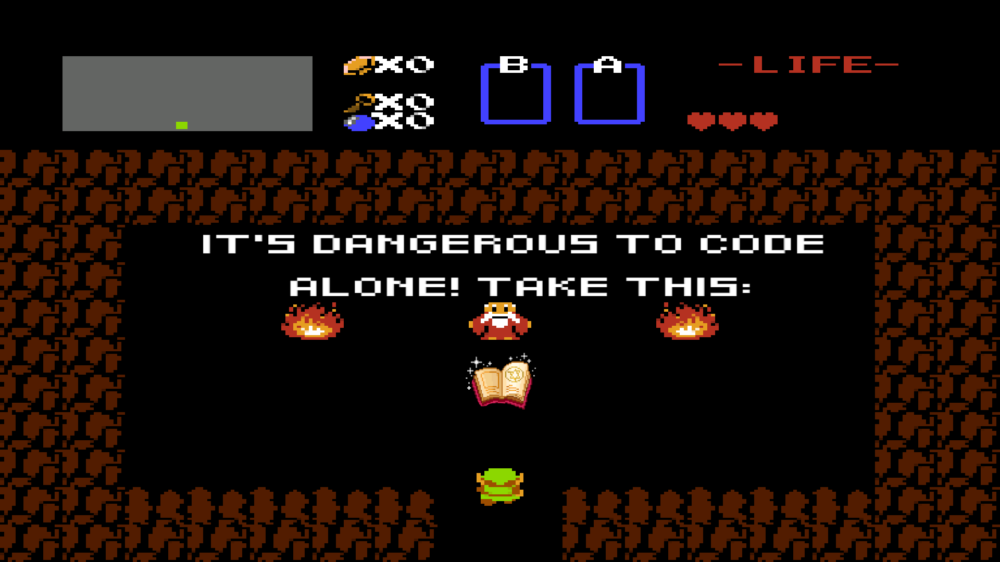
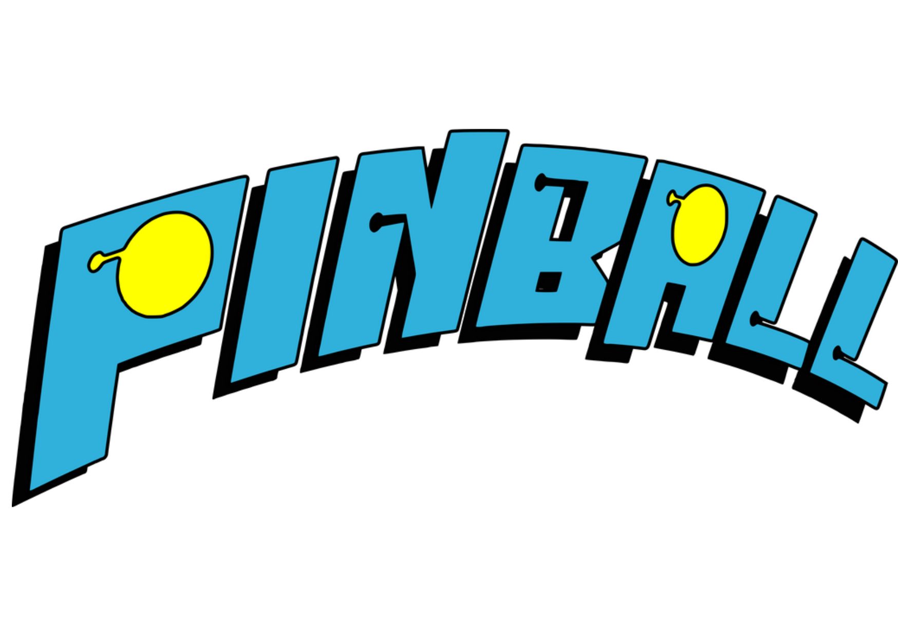

# Pinball handbook
<div style="text-align: center;">


In this handbook you'll learn base understanding and overview of the code you'll work with during the hackathon.

This Handbook is for the **Pinball** Game.
</div>

## Introduction
<div style="text-align: center;">


#### **What is Pygame?**


Pygame is a library designed for creating video games and multimedia applications in python. <br>
It provides modules and tools that simplify game development by handling many low-level tasks like rendering <br>
graphics, playing sounds, and processing input from devices like keyboards, mice, or game controllers.<br>
<br>
For a introduction in Pygame and some beginner tutorials we recommend reading the  **Pygames tutorial** you can find in gitlab. :)

<div style="text-align: center;">


#### **Game Rules and Goals**

Pinball is an arcade game played on a designed Pinball machine where the player manipulates one or more metal balls on a playfield by using Flippers to keep the ball in the game. If the ball reaches the hole at the bottom, the game is over.<br> 

The game's objective is to score as many points as possible by hitting obstacles in the playfield.<br>
<br>

#### **Playing the game**

To start the game the player launches the ball into the playfield by pressing **Space**.<br>
While the ball bounces around it hits the green obstacles, which grant points to the players score.<br>
To keep the ball going the player triggers the flippers by pressing **a** and **d** to hit the ball.


## Project Overview

The hackathon Pinball game consists of **5 python files**.<br>
Also, there is a Markdown File called **README.md**, which contains the Hackathon Challenges and a **summary** over the game files, functions, controls, starting the game<br>
...and some other noteworthy stuff.<br>

Read it to have a better overview of the files before you begin with the challenges. :)<br>
<br>
The ressources like the sprites and sounds for the game are organized in folders named:<br>
**Pics** for the game sprites.<br>
**Sounds** for the game sounds.


## How does the Game work?

As you have may have already seen, the code of the game is written in a object-oriented way. For Python beginners this could be a little hard to understand.<br>
<br>
Object-oriented programming (OOP) is necessary for a game, because it helps organizing the game into logical, reusable components.<br>
With this approach Pinball is represented in key elements like the game objects, the menu, the highscore manager, the game logic and so on **as classes** (the essential building blocks in OOP) and their behavior as **methods** (define the behavior of objects created from that class).<br>
<br>
To create an easier entry into the challenge this handbook provides some simple explanations of the code you'll be working with.

1. **The main game files**

It is common to divide the different key functionalities of a game in different files. This provides a better overview, readability and maintaining of the code.<br>
They're communicating on the base of importing other files, variables and functions from the different game files.<br>
On the base of this, the Pinball game is divided in <br>**5 main game files (.py)**.<br>

`Menu.py`: This file manages the game's menu system. It starts and ends the game and implements the different menu screens: main menu, options menu, highscore menu.<br>

`Highscore_Manager.py`: This file handles the highscore functionality. Reading and writing highscores to a file. <br>

`Music_Manager.py`: This file contains the MusicManager class which is responsible for: Managing music and sound volume levels.<br>

`Game.py`: This file contains the main loop which handles the game logic, initializes the game objects, renders game elements and manages game states, the score and game flow.<br>

`GameObjects.py`: This file defines the game objects used in the pinball game. It represents the game board, manages the flippers, handles the ball physics and defines the score obstacles that award points. <br>

**Look into the *Readme.md* file in your Pinball project for an overview of all the functions (and their functionalities) used in their respective gamefiles!**


2. **Game Logic**
<br>

The game logic is responsible for game states and coordination of game behaviour in specific situations.<br>
This is accomplished by defined `functions` or `methods` to manipulate the behaviour.<br>
Here is an overview of the most important functions and methods used in the code:<br>

2.1 **Functions**<br>

`main()`: The main game loop that initializes components and manages the overall flow.
<br><br>
`render_...()`: Renders different game objects, e.g. the game board, the balls, the flippers, the score.
<br><br>
`not_started()`: Resets game variables and initializes game objects.
<br><br>
`game_running()`: Handles the main gameplay, including ball movement and flipper control.
<br><br>
`game_finished()`: Displays the final score and prompts for the player's name.
<br>

2.2. **Methods**<br>

`sprite()`: The .sprite method is used to access a single sprite within a Group object.<br>
   <details>
    <summary>Example for the right flipper movement</summary>

    self.flipper_Right.sprite.moveFlipper(simulationSteps, pressed_a, pressed_d)
   </details>
   <br>

`groups()`: This method groups related sprites together for easier management.
    <details>
    <summary>Example for adding new balls</summary>

    self.balls_Group.add(ball)
   </details>
   <br>

`position()`: This is used to manage the locations of game elements in the game.
    <details>
    <summary>Example for adjusting the starting position</summary>

    self.start_Position[0]
   </details>
   <br>

`get__pressed()`: Checks by a boolean value if a game object is being manipulated by a keyboard input.
    <details>
    <summary>Example for checking if spacebar is pressed </summary>

    keys = pygame.key.get_pressed()
    if keys[pygame.K_SPACE]:
    print("The spacebar is being pressed")
   </details>
  

**For more Pygame specific explanations be sure to check out the Pygame tutorial in Gitlab!** 

## Object-oriented code structure of the game
####  Objects
In object-oriented programming a group of related variables and functions get combined in Units. This is called the **object**.<br>
In Python, objects are instances of a class, so you need to create a class in order to create an object. <br>
A class is basically a "Blueprint" of specific objects. 

To create a class you need to use the keyword `class`. You can already assign properties to the class and create an object.
<br>
Python has a built in function called `__init()__` to assign values to object properties.
<br>
To make the object to something more than just a data-container, you can define `methods` which define functionalities based on its variables.
<br>
Methods encapsulate specific logic and behavior of a class and its instances. Similiar to the initiation function, you need to use `def` to define a method.
<br><br>
**Example of a simple object-oriented code:**
<details>
<summary>class example</summary>

```python3
class Dog:
    species = "Dog" #Class attribute -> General for all instances
    legs = 4

    def __init__(self, name, age):
        self.name = name #Instance attribute -> Specific and independent for every instance
        self.age = age

    def bark(self, times):
        return ("Bark!" * times)


d1 = Dog("Doggie", 36)

print(d1.name)  # Output: Doggie
print(d1.age)   # Output: 36
print(d1.species) # Output: Dog
print(d1.legs)  # Output: 4
print(d1.bark(4)) # Output: Bark!Bark!Bark!Bark!
```
</details>
<br>

The `self` parameter is used as a reference to the current instance. It is needed to access the variables and methods that belongs to the instance. 
<br> Without this parameter, Python wouldn't know how to divide between class and instance attributes!
<br>

Pinball uses classes for objects like the Menu, but also for game objects like the flippers and functionalities like the highsore manager.

<details>
<summary>Show code example</summary>

```Python3
class Game:
    def __init__(self, pMusic_Manager,main_Menu_Function,highscore_Menu_Function, draw_Text_Function):
        self.screen = None
        
        #settings
        #the point where the balls are stacked
        self.start_Position=pygame.Vector2(920, 1400) #920-930:1400 starts in right hole position. 500:1200 starts in middle
        #flippers
        self.flipper_right_Position=(540,1284)
        self.flipper_left_Position=(335,1284)
        self.flipper_Left = pygame.sprite.GroupSingle()
        self.flipper_Right = pygame.sprite.GroupSingle()


        self.zoom_game_map=1600/pygame.display.get_window_size()[1]
        #ball settings

        self.ball_amount = 1 #how many lives are left
        self.power = 22 # how much energy is in the current push

        self.balls_Group = pygame.sprite.Group()
        
        #map properties
        board_Tex = pygame.image.load("pics/pinball map2.png").convert() #LOAD MAP
        board_Tex_Scaled = pygame.transform.scale(board_Tex, (board_Tex.get_width() / self.zoom_game_map, board_Tex.get_height() / self.zoom_game_map)).convert()
        board_Tex_Scaled.set_colorkey("white") #which color is exempt from the collision map
        self.game_Map = GameObjects.Board(board_Tex_Scaled,0,0) #creates the sprite for the board
        self.map_Group = pygame.sprite.GroupSingle() # group for the map
        self.map_Group.add(self.game_Map)

        #gamestate properties. Where is the game right now?
        self.init_Gamestate = None
        self.gamestate = None

    !MORE CODE IN GAME FILE!

``` 
</details>


<br>
In this code example, you can see how the structure is similar to the example programme, but slightly more complicated. Try to familiarise yourself 
with the code and its functions and methods and work your way through the challenges. If you need help, don't hesitate to use the **Pygame tutorial** 
or ask someone for support.<br><br>
We hope you enjoy the challenges!<br>
Have Fun!


